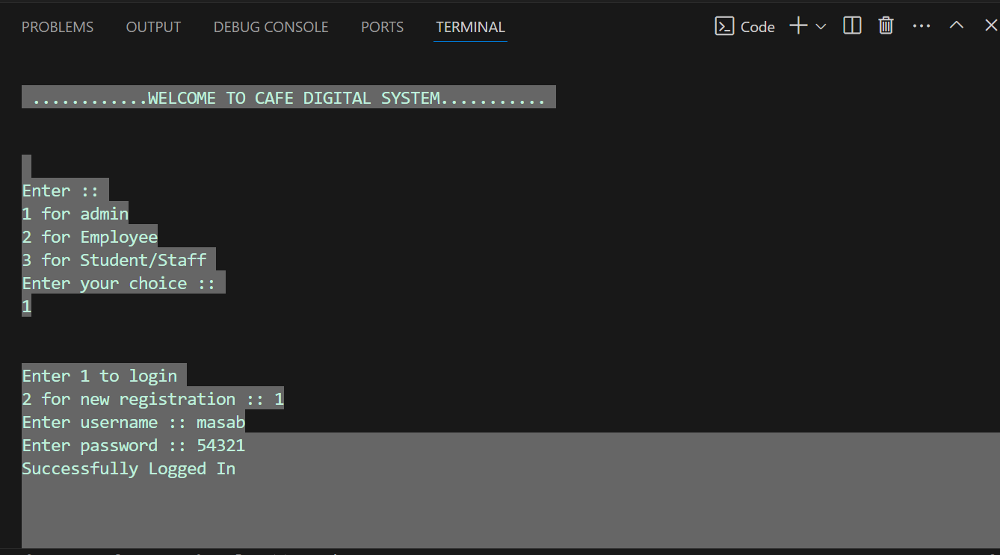
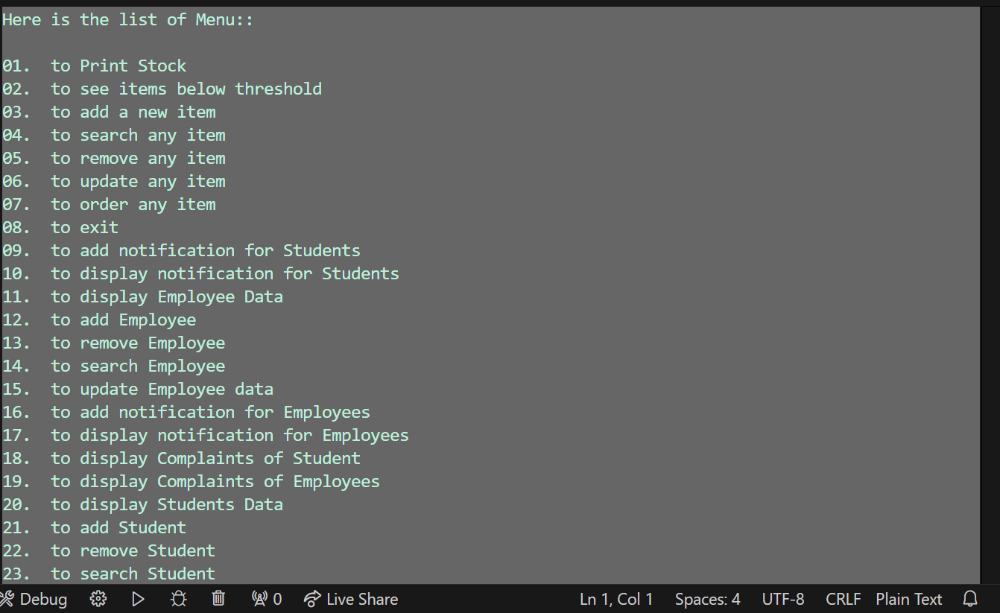

Café Management System

This is a comprehensive Café Management System project implemented in C++ for Programming Fundamentals. The project is crafted with full dedication and includes several essential features to streamline café operations.

Features

Login Module: Secure login authentication for students, admins, and employee.

Admin Panel: Manage the overall system with ease.

Student Module: Special functionalities for students.

Employee Module: Efficient handling of employee-related tasks.

Order Management System: Seamless ordering experience.

File Handling: Persistent data storage for efficient management.

Modular Code: Organized into .h and .cpp files for better structure and maintainability.

User-Friendly Logic: Designed to be simple and intuitive, ensuring accessibility for all.

How to Use

Download all the files from this repository.
Place all the files in the same folder.
Compile and run the project.cpp file to get started.

Highlights

Developed with a focus on simplicity and functionality.

Ideal for learning the basics of C++ while building a practical application.

Perfect for academic projects or exploring programming fundamentals.

If you find this project helpful:

🌟 Star this repository to show your appreciation.

🛠️ Feel free to contribute or provide suggestions for improvement.

Here are the screenshots of the Café Management System in action:

